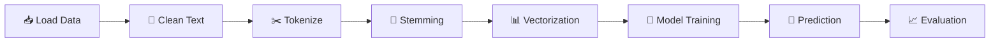

# 🎬 IMDB Movie Review Sentiment Analysis

<div align="center">


</div>

<div align="center">
  
</div>

---

## 📊 Project Overview

This project performs **sentiment analysis** on IMDB movie reviews using Natural Language Processing (NLP) techniques and machine learning. The model classifies movie reviews as either **positive** or **negative** with impressive accuracy!

### ✨ Key Highlights

- 🎯 **50,000 movie reviews** analyzed
- 🔥 **88.26% accuracy** with TF-IDF features
- 📈 **78.93% accuracy** with Bag of Words
- ⚡ Advanced text preprocessing pipeline
- 🤖 Logistic Regression classifier

---

## 🛠️ Technologies Used

<div align="center">

| Technology | Purpose |
|------------|---------|
|  | Core Programming |
|  | Numerical Computing |
|  | Data Manipulation |
|  | Machine Learning |
|  | NLP Processing |

</div>

---

## 📁 Project Structure

```
📦 sentiment-analysis
├── 📓 Sentiment_Analysis.ipynb
├── 📄 README.md
├── 📊 IMDB Dataset.csv
└── 📝 requirements.txt
```

---

## 🚀 Getting Started

### Prerequisites

```bash
pip install pandas numpy nltk scikit-learn beautifulsoup4 textblob
```

### Installation

1️⃣ **Clone the repository**
```bash
git clone https://github.com/yourusername/sentiment-analysis.git
cd sentiment-analysis
```

2️⃣ **Install dependencies**
```bash
pip install -r requirements.txt
```

3️⃣ **Download NLTK data**
```python
import nltk
nltk.download('stopwords')
```

4️⃣ **Run the notebook**
```bash
jupyter notebook Sentiment_Analysis.ipynb
```

---

## 🔄 Workflow Pipeline



---

## 🔍 Data Preprocessing Steps

<details>
<summary><b>Click to expand preprocessing details</b></summary>

### 1. 🧹 Noise Removal
- Remove HTML tags using BeautifulSoup
- Strip special characters and brackets
- Clean whitespace

### 2. ✂️ Tokenization
- Split text into individual tokens
- Use ToktokTokenizer for efficient processing

### 3. 🚫 Stopword Removal
- Remove common English stopwords
- Preserve meaningful words

### 4. 🌱 Stemming
- Apply Porter Stemmer algorithm
- Reduce words to root form
- Example: "running" → "run"

</details>

---

## 📊 Feature Extraction

### Bag of Words (BOW)
```python
CountVectorizer(min_df=1, max_df=1.0, ngram_range=(1,3))
```
- **Vocabulary Size**: 5,853,970 features
- **Accuracy**: 78.93%

### TF-IDF
```python
TfidfVectorizer(min_df=1, max_df=1.0, ngram_range=(1,3))
```
- **Vocabulary Size**: 5,853,970 features
- **Accuracy**: 88.26% ⭐

---

## 🎯 Model Performance

<div align="center">

| Method | Training Samples | Test Samples | Accuracy |
|--------|-----------------|--------------|----------|
| **Bag of Words** | 30,000 | 20,000 | 78.93% |
| **TF-IDF** | 30,000 | 20,000 | **88.26%** 🏆 |

</div>

### 📈 Performance Visualization

```
TF-IDF:  ████████████████████████████████████████████  88.26%
BOW:     ███████████████████████████████████           78.93%
```

---

## 💡 Key Features

- ✅ Balanced dataset (25,000 positive + 25,000 negative reviews)
- ✅ N-gram analysis (unigrams, bigrams, trigrams)
- ✅ Advanced text normalization
- ✅ Logistic Regression with L2 regularization
- ✅ Comprehensive evaluation metrics

---

## 📝 Usage Example

```python
# Import libraries
import pandas as pd
from sklearn.feature_extraction.text import TfidfVectorizer
from sklearn.linear_model import LogisticRegression

# Load and preprocess data
data = pd.read_csv("IMDB Dataset.csv")

# Train model
vectorizer = TfidfVectorizer(ngram_range=(1,3))
X_train = vectorizer.fit_transform(train_reviews)
model = LogisticRegression(max_iter=500)
model.fit(X_train, y_train)

# Predict sentiment
prediction = model.predict(vectorizer.transform(["This movie was amazing!"]))
print(f"Sentiment: {prediction[0]}")  # Output: positive
```

---

## 🎓 Learning Outcomes

- 🧠 Text preprocessing and normalization
- 📊 Feature extraction techniques (BOW, TF-IDF)
- 🤖 Binary classification with Logistic Regression
- 📈 Model evaluation and comparison
- 💻 End-to-end NLP project development

---

## 🔮 Future Enhancements

- [ ] Implement deep learning models (LSTM, BERT)
- [ ] Add cross-validation
- [ ] Create web interface with Flask/Streamlit
- [ ] Real-time sentiment prediction API
- [ ] Multilingual sentiment analysis
- [ ] Emotion detection (beyond positive/negative)

---

## 📚 Dataset Information

**Source**: IMDB Movie Reviews Dataset
- **Total Reviews**: 50,000
- **Positive**: 25,000
- **Negative**: 25,000
- **Balance**: Perfectly balanced ⚖️

---

## 🤝 Contributing

Contributions are welcome! Please feel free to submit a Pull Request.

1. Fork the project
2. Create your feature branch (`git checkout -b feature/AmazingFeature`)
3. Commit your changes (`git commit -m 'Add some AmazingFeature'`)
4. Push to the branch (`git push origin feature/AmazingFeature`)
5. Open a Pull Request

---

## 📄 License

This project is licensed under the MIT License - see the [LICENSE](LICENSE) file for details.

---

## 👨‍💻 Author

**Your Name**

- GitHub: [@yourusername](https://github.com/yourusername)
- LinkedIn: [Your Profile](https://linkedin.com/in/yourprofile)
- Email: your.email@example.com

---

## 🙏 Acknowledgments

- IMDB for the dataset
- scikit-learn community
- NLTK developers
- All contributors and supporters

---

<div align="center">

### ⭐ Star this repository if you found it helpful!


**Made with ❤️ for NLP enthusiasts**

</div>

---

## 📊 Project Stats


---

<div align="center">
  <sub>Built with 🔥 by passionate developers</sub>
</div>
